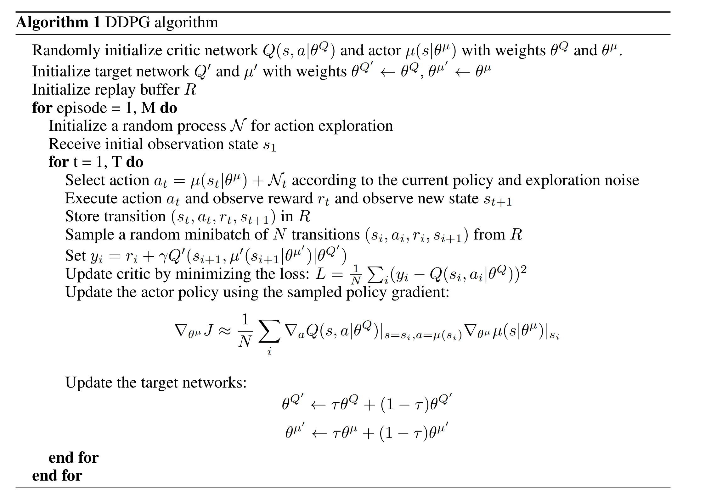
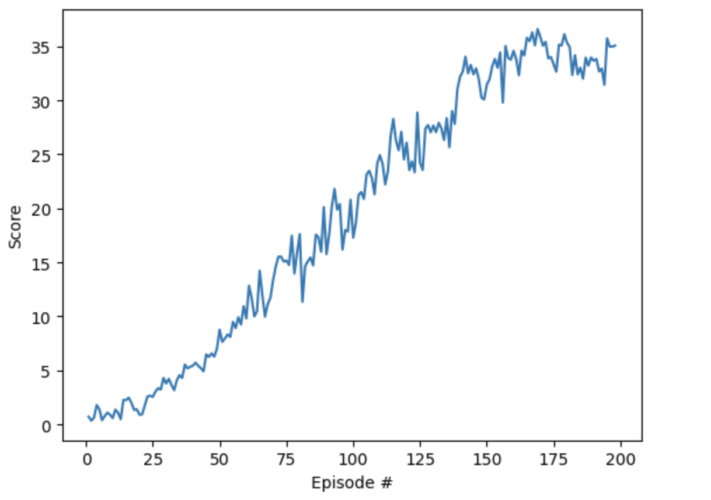

# Description of the implementation
A modified version of Deep Deterministic Policy Gradients (DDPG) algorithm provided by [Udacity excerise](https://github.com/udacity/deep-reinforcement-learning/tree/master/ddpg-bipedal) is being adapted and modified.

The modifications done are as follows:
1. adapt the DDPG to work with Unity environment.
2. to make the code run with more than 1 agent.
3. gradient clippings to critiqie local, "ddpg_agent.py"
4. change of neural network archticture.
5. The number of updates in each step is changed to be 1 every 20 times. "ddpg_agent.py" step function.

# Learning Algorithm:

### The learning algorithm

[Continuous control with deep reinforcement learning](https://arxiv.org/abs/1509.02971)

### Hyperparameters:

BUFFER_SIZE = int(1e5)  # replay buffer size

BATCH_SIZE = 128         # minibatch size

GAMMA = 0.99            # discount factor

TAU = 1e-3              # for soft update of target parameters

LR_ACTOR = 1e-3         # learning rate of the actor 

LR_CRITIC = 1e-3        # learning rate of the critic

WEIGHT_DECAY = 0        # L2 weight decay

### Model architectures:

* Actor network's inputs are the state size and its output is the action size. There are 2 hidden layers each of which of size 256.

* Critic network:  It takes the states and action as input, its output is predicting a reward score. Two hiddent layers of size 256 are used.

# Plot of Rewards:

# Ideas for Future Work:
1. Experimenting more with the network, i.e, the effect of using batch normalization.
2. Exploring a new teqniaues such as [Distributed Distributional Deterministic Policy Gradients](https://openreview.net/forum?id=SyZipzbCb)
